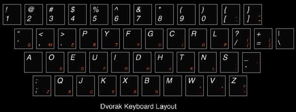

# odin-recipes

This is the first project from the odin projects curriculum. It will be a small collection of recipes and corresponding pictures.

Look forward to:
----------------

*Lists!*

1. like 
2. this
3. one

*Unordered lists!*

- like
- this
- one

*even small paragraphs!*

like this one

`
Lorem ipsum dolor sit amet, consectetuer adipiscing elit. Aenean commodo ligula eget dolor. Aenean massa. Cum sociis natoque penatibus et magnis dis parturient montes, nascetur ridiculus mus. Donec quam felis, ultricies nec, pellentesque eu, pretium quis, sem.
`

Now containing:
---------------

*Images!*

<figure>

<figcaption>Feel special, type with Dvorak!!</figcaption>
</figure>

Start with [monkeype][1] brush up on problem areas with [The Practice Test][2] and if you still have some steam, every character counts if you like [hard-mode][3].

This was also a good reason to start practicing using markdown. I tried to include the elements I found neat for practice, so thats why it looks so **AWESOME**.

[1]: http://www.monkeytype.com/ "MonkeyType"
[2]: http://thepracticetest.com/  "The Practice Test"
[3]: http://climech.github.io/typing-practice//    "hard-mode"